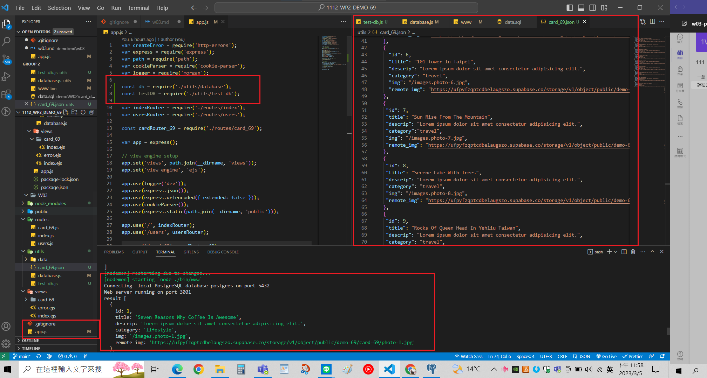
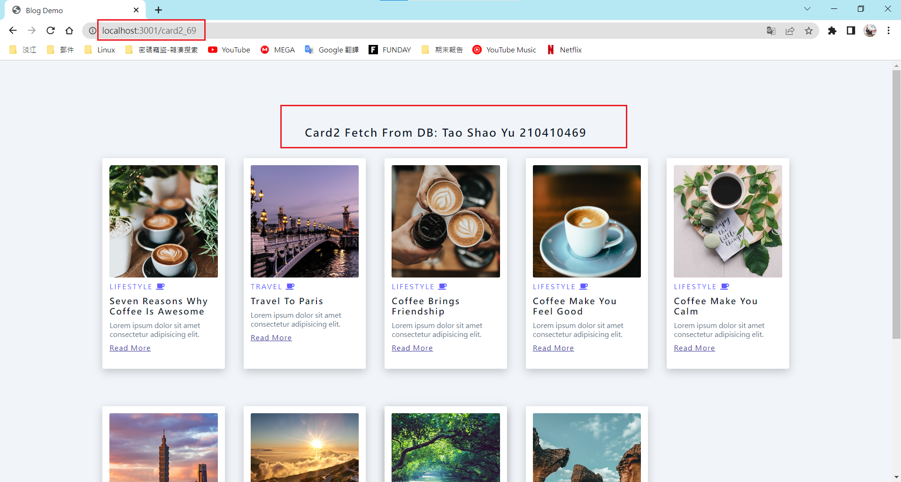
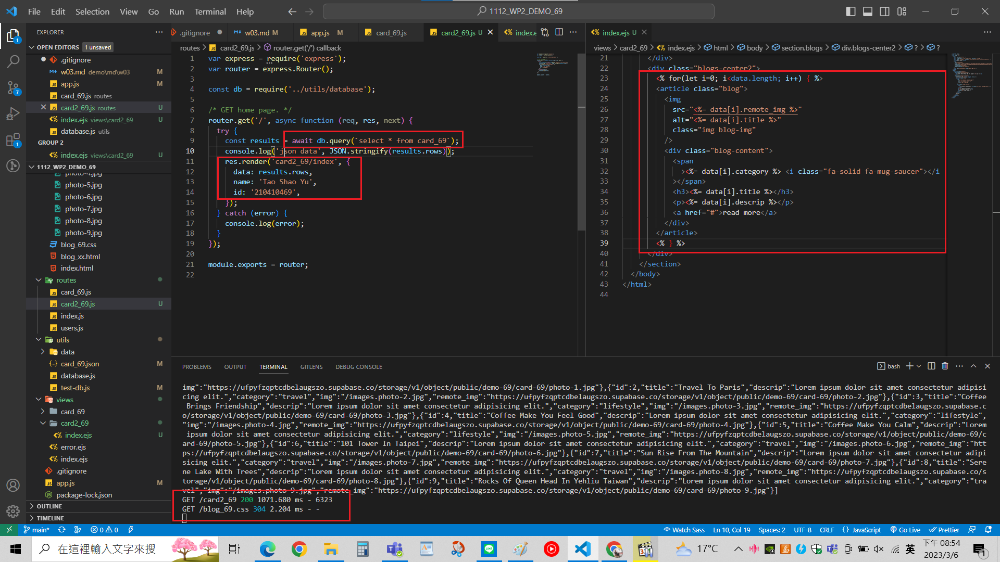
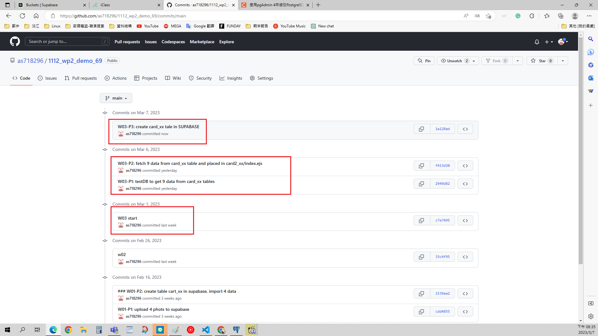

[My Github Repo URL](https://github.com/as718296/1112_wp2_demo_69.git)

### W03-P1: testDB to get 9 data from card_xx tables

### W03-P2: fetch 9 data from card_xx table and placed in card2_xx/index.ejs

### W03-P3: create card_xx tale in SUPABASE

### W03-logs

