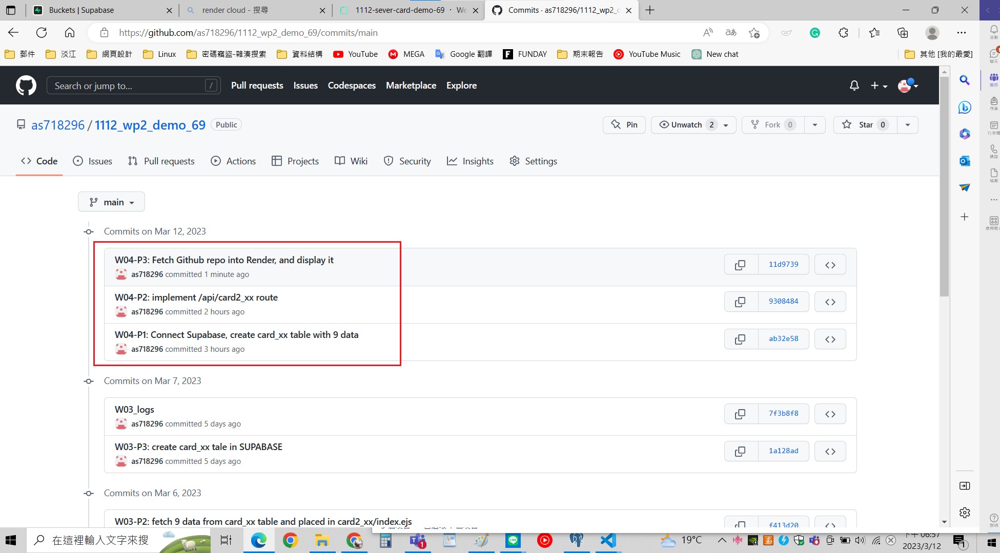

[My Github Repo URL](https://github.com/as718296/1112_wp2_demo_69.git)

### W04-P1: Connect Supabase, create card_xx table with 9 data

### W04-P2: implement /api/card2_xx route

### W04-P3: Fetch Github repo into Render, and display it

### W04-logs

