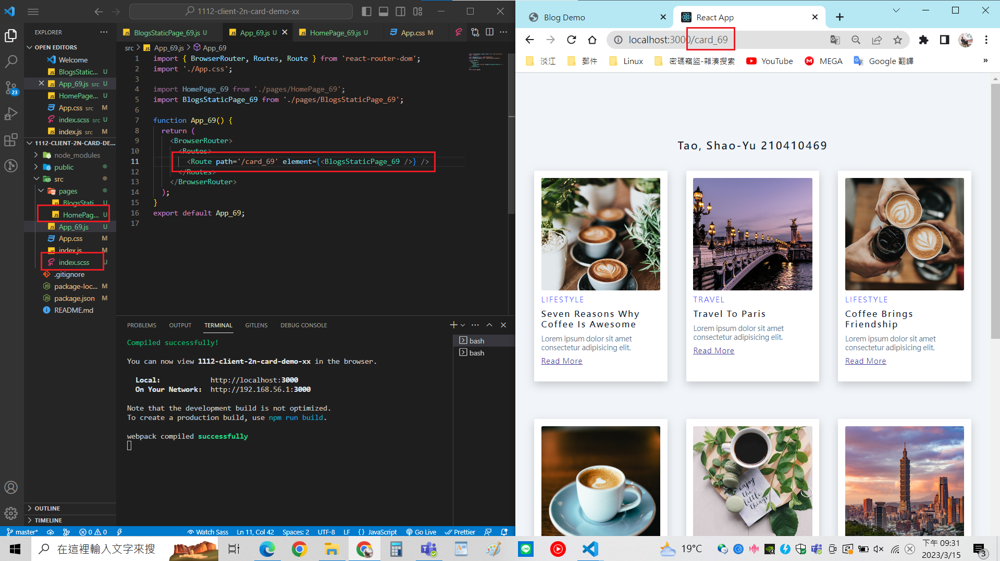
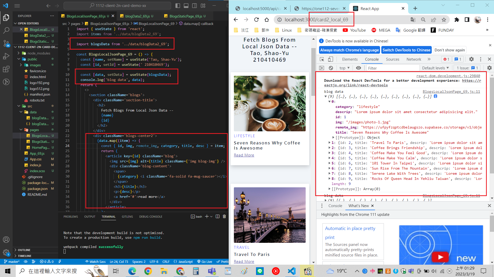
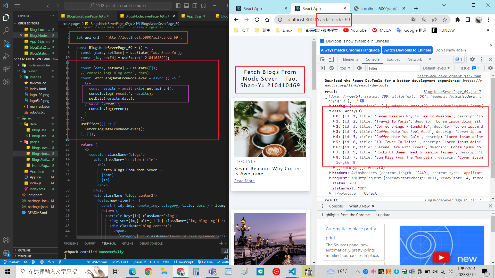
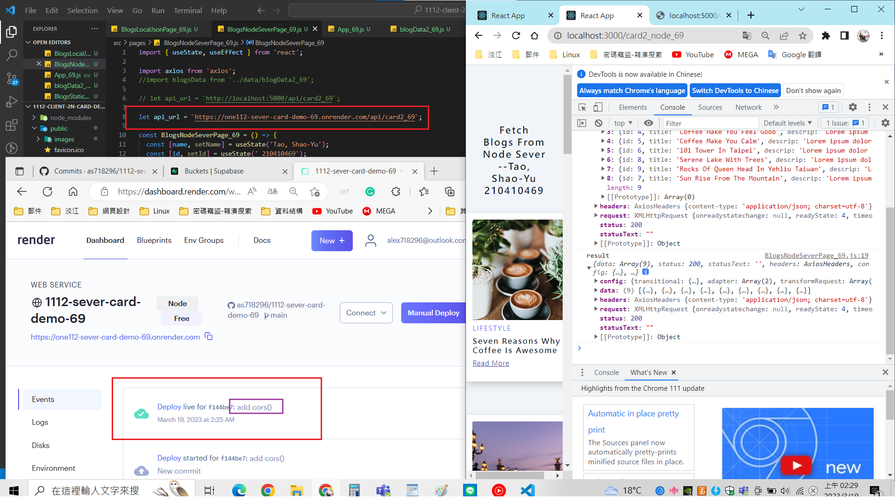
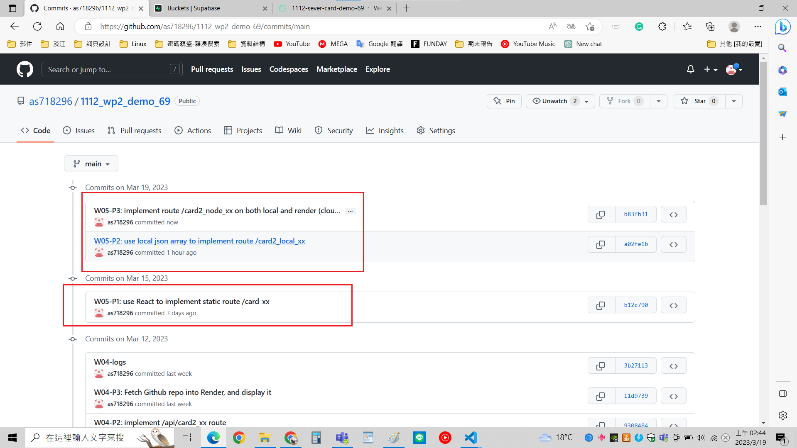

[My Github Repo URL](https://github.com/as718296/1112_wp2_demo_69.git)

### W05-P1: use React to implement static route /card_xx

### W05-P2: use local json array to implement route /card2_local_xx

### W05-P3: implement route /card2_node_xx on both local and render (cloud) server

### W05-logs

